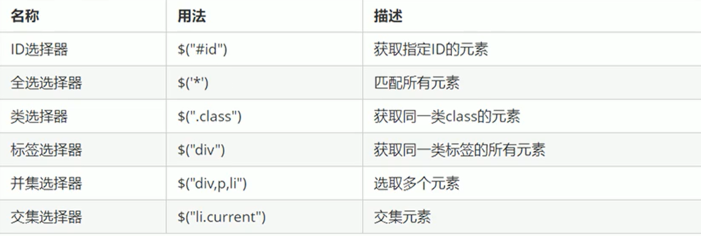
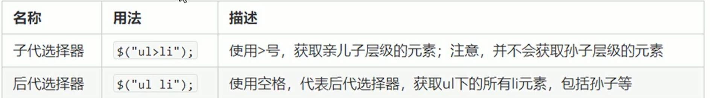
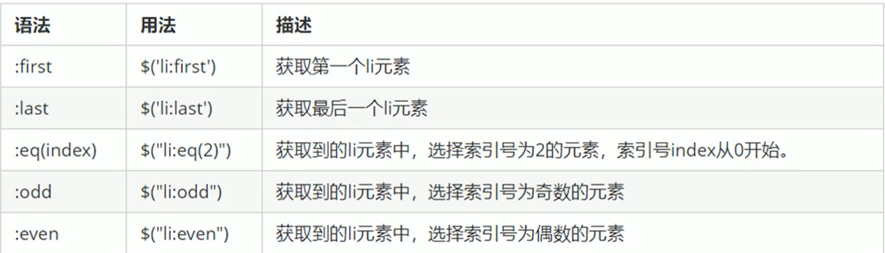
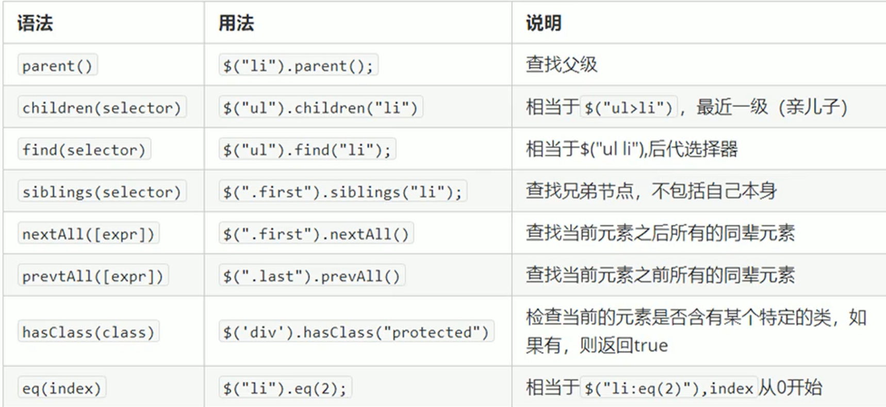

# jQuery常用API

# jQuery选择器

原生JS获取元素方式很多, 很杂, 而且兼容性情况不一致, 因此jQuery给我们进行了封装, 使获取元素统一标准

`$('选择器') // 里面直接写css选择器, 注意要加引号`

## 基础选择器

​

## 层级选择器

​

## 筛选选择器

​

# 隐式迭代 

遍历内部DOM元素 (伪数组形式存储) 的过程叫做 ==隐式迭代==

简单理解 : 给匹配到的所有元素进行循环遍历., 执行相应的方法, 而不用我们再进行循环, 简化我的操作, 方便我们调用

# 筛选方法 

​

常用的由 `parent() children() find() sibling() qu()`

# 排他思想

```js
    <body>
        <button>点击</button>
        <button>点击</button>
        <button>点击</button>
        <button>点击</button>
        <button>点击</button>
        <button>点击</button>
        <button>点击</button>
        <button>点击</button>
        <script>
            $("button").mouseover(function () {
                $(this).css("background", "pink");
                $(this).siblings("button").css("background", "none");
            });
        </script>
    </body>
```

# 链式编程

链式编程是为了节省代码量, 看起来更优雅

`$(this).css("color","red").sibling().css("color","");`

使用链式编程时一定要注意是那个对象执行样式

‍
