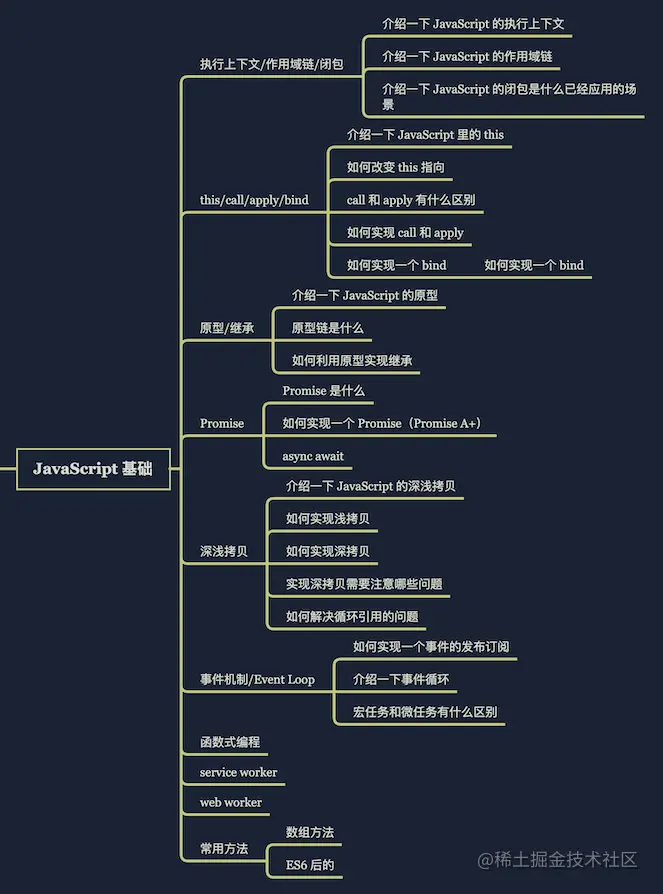

# 路线图

||||
||||
| ------------| --------------------------------| --|
|HTML|页面结构|页面元素和内容|
|CSS|页面表现|页面元素的外观和位置等页面样式|
|JavaScript|页面行为|网页模型的定义与页面交互|

新手入门：

* [X] HTML5+CSS3+实战项目[https://www.bilibili.com/video/BV1Kg411T7t9](https://www.bilibili.com/video/BV1Kg411T7t9) -->
* [X] 移动web[https://www.bilibili.com/video/BV1xq4y1q7jZ](https://www.bilibili.com/video/BV1xq4y1q7jZ)

JavaScript阶段：

* [X] JavaScript基础[https://www.bilibili.com/video/BV1ux411d75J](https://www.bilibili.com/video/BV1ux411d75J)-->
* [X] JavaScript核心Web APIs[https://www.bilibili.com/video/BV1k4411w7sV](https://www.bilibili.com/video/BV1k4411w7sV)-->
* [X] [2019全新javaScript进阶面向对象ES6_哔哩哔哩_bilibili](https://www.bilibili.com/video/BV1Kt411w7MP?p=1)
* [X] [黑马程序员前端基础必备教程|jQuery网页开发案例精讲_哔哩哔哩_bilibili](https://www.bilibili.com/video/BV1a4411w7Gx)
* [X] 数据交互 & 异步编程Ajax\Git[https://www.bilibili.com/video/BV1zs411h74a](https://www.bilibili.com/video/BV1zs411h74a)

VUE开发：

* [X] 框架前置课Nodejs&es6[https://www.bilibili.com/video/BV1a34y167AZ](https://www.bilibili.com/video/BV1a34y167AZ)-->
* [ ] Vue2+Vue3全套[https://www.bilibili.com/video/BV1zq4y1p7ga](https://www.bilibili.com/video/BV1zq4y1p7ga)

React + 微信小程序：

* [ ] React[https://www.bilibili.com/video/BV1gh411U7JD](https://www.bilibili.com/video/BV1gh411U7JD)-->
* [ ] TypeScript[https://www.bilibili.com/video/BV14Z4y1u7pi](https://www.bilibili.com/video/BV14Z4y1u7pi)-->
* [ ] 微信小程序 [https://www.bilibili.com/video/BV1834y1676P](https://www.bilibili.com/video/BV1834y1676P)

---

* [X] HTML+CSS
* [X] HTML5
* [X] 移动web
* [X] Javascript
* [X] WebApis
* [X] 数据交互 异步编程
* [X] Node.Js
* [ ] Vue2/Vue3
* [ ] React
* [ ] 微信小程序

‍

‍

* [ ] 一、CSS问题
* [ ] 1.[flex布局](https://www.zhihu.com/search?q=flex%E5%B8%83%E5%B1%80&search_source=Entity&hybrid_search_source=Entity&hybrid_search_extra=%7B%22sourceType%22%3A%22answer%22%2C%22sourceId%22%3A2020539466%7D)
* [ ] 2.css3的新特性
* [ ] 3.img中alt和title的区别
* [ ] 4.用纯CSS创建一个[三角形](https://www.zhihu.com/search?q=%E4%B8%89%E8%A7%92%E5%BD%A2&search_source=Entity&hybrid_search_source=Entity&hybrid_search_extra=%7B%22sourceType%22%3A%22answer%22%2C%22sourceId%22%3A2020539466%7D)
* [ ] 5.如何理解CSS的盒子模型？
* [ ] 6.如何让一个div水平居中
* [ ] 7.如何让一个div水平垂直居中
* [ ] 8.如何清除浮动？
* [ ] 9.css3实现三栏布局，左右固定，中间自适应
* [ ] 10.display:none 和 visibility: hidden的区别
* [ ] 11.CSS中 link 和@import 的区别是？
* [ ] 12.position的absolute与fixed共同点与不同点
* [ ] 13…transition和animation的区别
* [ ] 14.CSS优先级
* [ ] 15.雪碧图：
* [ ] 二、JS问题
* [ ] 1.typeof和instance of 检测数据类型有什么区别？
* [ ] 2.使元素消失的方法
* [ ] 3.es6的新特性都有哪些？
* [ ] 4.和=区别是什么？
* [ ] 5.常见的设计模式有哪些？
* [ ] [6.call](http://6.call) bind apply 的区别？
* [ ] 7.js继承方式有哪些？
* [ ] 8.你怎样看待闭包？
* [ ] 9.你是如何理解原型和原型链的？
* [ ] 10.浏览器渲染的主要流程是什么?
* [ ] 11.从输入url地址到页面相应都发生了什么？
* [ ] 12.session、cookie、localStorage的区别
* [ ] 13.js中跨域方法
* [ ] 14.前端有哪些页面优化方法?
* [ ] 15.Ajax的四个步骤
* [ ] 16.数组去重的方法
* [ ] 17.ajax中get和post请求的区别
* [ ] 18.ajax的状态码
* [ ] 19.移动端的兼容问题
* [ ] 20.JS中同步和异步,以及js的事件流
* [ ] 24.DOM diff原理
* [ ] 25.[作用域](https://www.zhihu.com/search?q=%E4%BD%9C%E7%94%A8%E5%9F%9F&search_source=Entity&hybrid_search_source=Entity&hybrid_search_extra=%7B%22sourceType%22%3A%22answer%22%2C%22sourceId%22%3A2020539466%7D)、全局作用域
* [ ] 26.Promise处理异步
* [ ] 27.map和forEach的区别、相同点
* [ ] 28.async await函数
* [ ] 29.this指向
* [ ] 30.原型
* [ ] 31.异步回调（如何解决回调地狱）
* [ ] 32.前端事件流
* [ ] 33.事件如何先捕获后冒泡？
* [ ] 34. 如何判断一个变量是对象还是数组（[prototype.toString.call](http://prototype.toString.call)()）。
* [ ] 35. setTimeout 和 setInterval的机制
* [ ] 36. splice和slice、map和forEach、 filter()、reduce()的区别
* [ ] 三、VUE问题
* [ ] 1.聊聊对vue的理解
* [ ] 2.V-model的原理是什么？
* [ ] 3.谈谈对生命周期的理解
* [ ] 4.VUE和REACT有什么区别？
* [ ] 5.vuex的流程
* [ ] 6.vuex有哪几种状态和属性
* [ ] 7.vue路由的两种模式
* [ ] 8.vue中 key 值的作用
* [ ] 9r o u t e 和 route和route和router的区别
* [ ] 10.vue-router守卫
* [ ] 11.axios是什么？怎么使用？描述使用它实现登录功能的流程？
* [ ] 12.vue修饰符
* [ ] 13.vue项目中的性能优化
* [ ] 14.[vue.extend](https://www.zhihu.com/search?q=vue.extend&search_source=Entity&hybrid_search_source=Entity&hybrid_search_extra=%7B%22sourceType%22%3A%22answer%22%2C%22sourceId%22%3A2020539466%7D)和vue.component
* [ ] 四、React问题
* [ ] 1.react和vue的区别
* [ ] 2.redux中的reducer（纯函数）
* [ ] 3.react的refs
* [ ] 4.react中的keys
* [ ] 5.React的生命周期
* [ ] 6.React子组件向父组件传值
* [ ] 7.为什么虚拟DOM会提高性能
* [ ] 8.[diff算法](https://www.zhihu.com/search?q=diff%E7%AE%97%E6%B3%95&search_source=Entity&hybrid_search_source=Entity&hybrid_search_extra=%7B%22sourceType%22%3A%22answer%22%2C%22sourceId%22%3A2020539466%7D)
* [ ] 9.简述下flux的思想
* [ ] 10.reac性能优化是哪个周期函
* [ ] 11.react怎么划分业务组件和技术组件
* [ ] 12.setState
* [ ] 五、性能优化
* [ ] 1.webpack打包文件体积过大？（最终打包为一个js文件）
* [ ] 2.如何优化webpack构建的性能
* [ ] 3.移动端的性能优化
* [ ] 4.Vue的SPA 如何优化加载速度
* [ ] 5.移动端300ms延迟
* [ ] 6.页面的重构

以前端为例，抓住一个点往死里问的：  
Promise 原理，HTTP TCP ，Webpack 配置 是否写过插件 原理，Vue 原理 虚拟 Dom Diff 算法原理 懒加载如何实现的，  
介绍一下写过的项目 项目优化 架构优化 遇到过的难点  
手写个 节流去抖 柯里化 快排  
有没有博客 开源项目

# 知识点

## ①HTML/CSS篇

这个阶段的学习周期大概是15天左右，你需要掌握以下这些知识点：

### **HTML**

* 文档结构
* DTD
* 注释
* 网页三要素
* SEO
* 标签
* 属性
* 结构
* 规范
* 书写风格
* 语义化

### **CSS**

* 选择器
* 优先级
* 权重
* 定位
* 浮动
* flex
* 盒子模型
* BFC
* 字符串类
* 包装类
* 渲染原理
* 代码规范
* 性能优化
* 布局思维
* CSS3动画特效

## **②JavaScript篇**

这个阶段的学习周期在50天左右，需要掌握的下面这些知识点：

### **ECMAScript**

* 语言基础概念
* 语句语法
* 数据类型
* 隐式转换
* 运算符
* 运算规则
* 作用域解析
* JS解释引擎

### **控制流程**

* for/for of/for in
* 短路运算
* 位运算
* 三目运算
* Switch
* 垂直过滤
* while do while
* 排序
* 去重
* 终止
* 返回

### **内置API**

* 字符串API
* 数组API
* 对象API
* 日期API
* 正则表达式
* 工具类

### **机制原理**

* 存储机制
* 深拷贝/浅拷贝
* 字面量
* 包装对象
* 同步/异步
* 闭包模块化
* 性能调优
* 工厂模式
* 执行上下文
* 垃圾GC
* 闭包
* debug方式方法

### **函数式编程**

* 纯函数
* 偏函数
* 递归函数
* [柯里化函数](https://www.zhihu.com/search?q=%E6%9F%AF%E9%87%8C%E5%8C%96%E5%87%BD%E6%95%B0&search_source=Entity&hybrid_search_source=Entity&hybrid_search_extra=%7B%22sourceType%22%3A%22answer%22%2C%22sourceId%22%3A2400270055%7D)
* 回调函数
* 缓存函数
* 组合函数
* 通道函数
* 防抖节流
* 高级函数
* IIFE函数

### **面向对象**

* 构造函数
* 原型/原型链
* 原型指向
* 封装
* 继承
* 多重继承
* 包装对象
* this指向
* this偏移

### **DOM**

* DOM概念
* 节点与遍历树
* GUI渲染行为
* 虚拟DOM
* 节点增删改查
* 位置与偏移
* 对象与标签
* Event时间
* 鼠标/键盘
* 定时器
* 监听器
* 事件委托
* 代理/分流
* [事件冒泡](https://www.zhihu.com/search?q=%E4%BA%8B%E4%BB%B6%E5%86%92%E6%B3%A1&search_source=Entity&hybrid_search_source=Entity&hybrid_search_extra=%7B%22sourceType%22%3A%22answer%22%2C%22sourceId%22%3A2400270055%7D)
* 默认行为
* 事件降频
* 行为锁
* [运动框架](https://www.zhihu.com/search?q=%E8%BF%90%E5%8A%A8%E6%A1%86%E6%9E%B6&search_source=Entity&hybrid_search_source=Entity&hybrid_search_extra=%7B%22sourceType%22%3A%22answer%22%2C%22sourceId%22%3A2400270055%7D)
* 物理模拟
* 碰撞检测
* 拖拽模组
* 重绘/重排

### **BOM**

* window对象
* Navigator
* location
* history
* hash
* screen
* document

### **ES扩展**

* 版本解读
* 兼容处理
* Let
* const
* 解构赋值
* 对象解构
* 箭头函数
* reset参数解构
* class面向对象
* set/get/extends
* super/static
* Symbol/promise
* async/await
* Defineproperty
* proxy代理
* 合并空值运算
* 链式询问
* 对象修饰
* 代理拦截
* Modules

## ③H5移动端篇

这个阶段的学习周期，在30天左右，需要掌握的内容如下：

### [移动端开发](https://www.zhihu.com/search?q=%E7%A7%BB%E5%8A%A8%E7%AB%AF%E5%BC%80%E5%8F%91&search_source=Entity&hybrid_search_source=Entity&hybrid_search_extra=%7B%22sourceType%22%3A%22answer%22%2C%22sourceId%22%3A2400270055%7D)****

* 移动端适配概念
* 尺寸与分辨率
* PPI/DPI/DIP/DPR
* 布局视口
* 理想视口
* 视觉视口
* rem适配方案
* vw/vh适配方案
* 高清适配方案
* Meta权限管理
* 刘海屏适配
* 图片高清适配
* 1px像素适配
* 移动端事件
* 默认行为处理

### **H5API**

* 新增标签
* 新增属性
* 多媒体
* 页面生命周期
* 状态监听
* Blob/FileReader
* sessionStorage
* localStorage
* fullScreen全屏
* Notifications通知
* worker多线程
* 网络状态
* 地理信息开发
* canvas交互
* 默认行为处理

### **预处理**

* sass语法
* less语法
* stylus语法
* css编程
* css模块化
* css表达式
* css循环判断
* 继承
* 嵌套
* 混入

### **模板引擎**

* art-template模板语法
* handlebars模板语法
* 原生js模板引擎
* 渲染机制

### **UI库**

* 学习快速上手UI库
* 文档学习
* 案例调试
* layerUI
* easyUI
* bootstrap
* WEUI
* Vonic
* mintUI
* elementUI
* Vant

### **DOM与其他库**

* jQuery/zepto
* touchjs/iScroll/swiper
* validator/Lodash
* axios/babel
* wangEditor
* store/qs/cy

### **开发管理**

* 原生库开发
* 第三方库hack
* 需求分析
* 业务规划
* 技术栈选型
* 文件输出规则
* 模型设计
* 底层搭建
* MVC设计模式
* 业务逻辑分类
* 数据分离
* 交互业务封装
* 模块对接
* 面向对象式业务设计

## ④Node服务端开发

这个阶段的学习周期大概在50天左右，需要掌握下面这些内容：

### **NPM**

* npm安装
* npm配置
* npm包管理
* npm本地包安装
* npm依赖管理
* npm版本控制
* npm项目初始

### **Node**

* V8引擎概念
* AMD/CMD/UMD
* fs文件操作
* IO流
* 异常处理
* 中间件
* HTTP模块
* URL/PATH模块
* EventLoop事件轮询
* 同步/异步
* 阻塞/非阻塞
* 宏任务
* 微任务
* 模块管理
* 模块应用
* [stream流](https://www.zhihu.com/search?q=stream%E6%B5%81&search_source=Entity&hybrid_search_source=Entity&hybrid_search_extra=%7B%22sourceType%22%3A%22answer%22%2C%22sourceId%22%3A2400270055%7D)
* Buffer对象
* Static静态封装
* 路由封装

### **前后端交互**

* HTTP通信交互
* [请求响应](https://www.zhihu.com/search?q=%E8%AF%B7%E6%B1%82%E5%93%8D%E5%BA%94&search_source=Entity&hybrid_search_source=Entity&hybrid_search_extra=%7B%22sourceType%22%3A%22answer%22%2C%22sourceId%22%3A2400270055%7D)、
* MIME
* URI解析
* TCP/IP协议
* socket协议
* 代理/缓存
* 网关/隧道
* ajax异步交互
* 跨域处理
* ajax封装
* axios使用
* 请求拦截
* 请求预验
* Method
* content-type
* cookie/session
* 通信加密RSA/MD5
* 登录注册

### **接口设计**

* 传统接口设计
* 接口文档
* 文档定义
* 数据接口概念与标准
* 状态码设计
* 响应格式
* 协商协议
* 合约说明
* 资源定位符
* 缓存机制
* HTTP头管理
* 松耦合实现
* RESTful设计原则
* RESTful实现

### **数据库**

* 基础概念
* NoSql行为操作
* CAP
* 基础语法
* shell/MongoDB驱动
* 增删改查
* 高级查询操作
* 通道查询
* 多条件查询
* 索引处理
* 聚合管道
* population联表
* validation验证
* 异常处理

### **服务端项目**

* 数据库设计
* 服务端路由设计
* API管理分类
* 注册登录
* 原生路由开发
* 权限/用户/分类
* 模块化功能封装
* 校验库封装
* 行为中控

## **⑤VUE框架篇**

这个阶段大概需要40天左右，需要掌握的内容如下：

### **webpack**

* 工程化概念
* webpack配置运行
* plugin插件
* loader使用
* 出入口配置
* 模块依赖处理
* devServer使用
* 文件切分
* 动态加载
* package管理
* 性能优化
* 测试处理

### **Vue基础**

* 工具与插件
* mv*设计模式
* mvvm原生实现
* 生命周期
* 命令属性
* 组件化
* 虚拟DOM
* 数据驱动
* 模板语法
* 条件列表
* 计算属性
* 修饰表单
* 监听过滤
* 组件通信
* 动画动效
* 高级组件

### **Vue工程化**

* webpack配置vue项目
* vue单文件组件
* vuecli命令服务
* 工程平台
* animate
* 兼容处理
* socket/loadsh
* preset
* 静态资源
* 环境变量
* 工程部署
* 打包优化
* 模式转换
* 构建目标

### **VueRouter**

* 路由概念
* 嵌套路由
* 动态路由
* 路由试图
* 编程式导航
* History
* [hash模式](https://www.zhihu.com/search?q=hash%E6%A8%A1%E5%BC%8F&search_source=Entity&hybrid_search_source=Entity&hybrid_search_extra=%7B%22sourceType%22%3A%22answer%22%2C%22sourceId%22%3A2400270055%7D)
* 命名视图
* 重定向/别名
* 导航守卫
* 路由原信息
* 路由拦截
* 滚动懒加载
* 故障处理
* 路由带参

### **Vuex**

* Store
* state
* getter
* mutation
* action
* module
* EventBus对比
* 状态管理模式
* vuex辅助函数
* vuexAPI
* vuex模块化处理规则
* 对象风格提交
* 模块重用

### **项目开发**

* PC+mobile无缝切换
* websocket聊天室
* 第三方组件
* 工具库使用
* 令牌管理
* 文章分类
* 登录注册
* [路由权限管理](https://www.zhihu.com/search?q=%E8%B7%AF%E7%94%B1%E6%9D%83%E9%99%90%E7%AE%A1%E7%90%86&search_source=Entity&hybrid_search_source=Entity&hybrid_search_extra=%7B%22sourceType%22%3A%22answer%22%2C%22sourceId%22%3A2400270055%7D)
* 加密校验
* Auth认真
* HTTP封装
* 富文本编辑
* 文章查询
* 分页管理
* 懒加载
* 组件分类封装
* 组件混合
* 高级组件开发
* ERROR封装
* 重置数据响应
* 通知组件封装
* 工程平台应用
* 项目打包
* 体积优化
* 速度优化

‍
